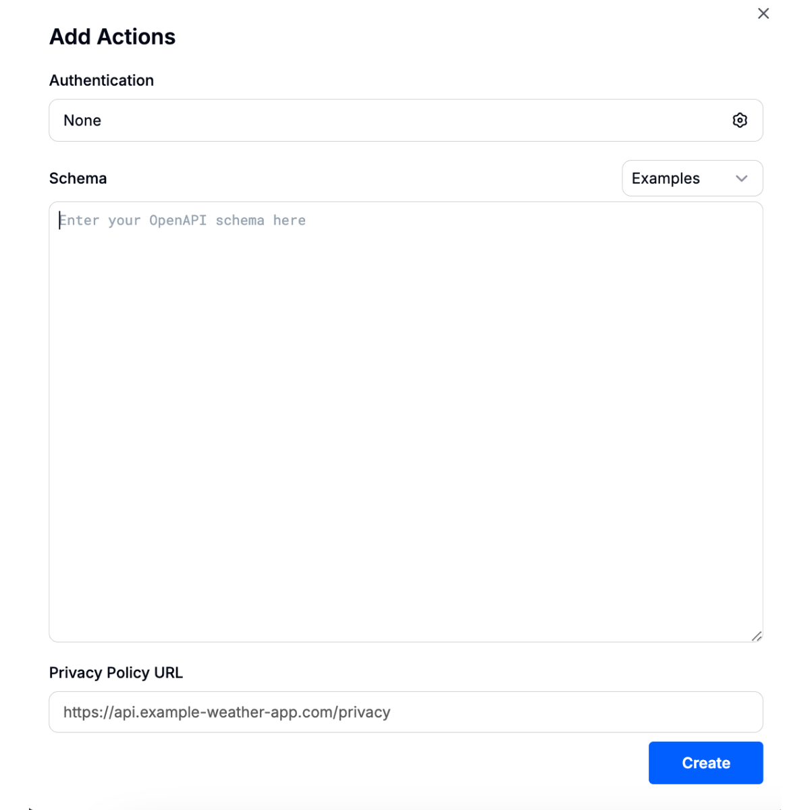
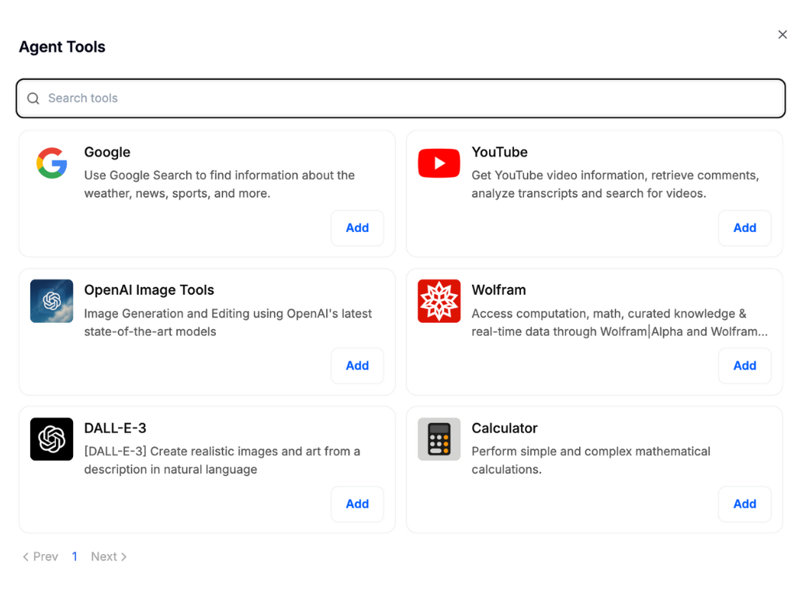

# AI Agents

[AI Agent Feature in Doraverse](./#ai-agent-feature-in-doraverse)

[Step-by-Step Guide to Build Your Own AI Agent in Doraverse](./#step-by-step-guide-to-build-your-own-ai-agent-in-doraverse)

[Using Your Agent](./#using-your-ai-agent)

[Why Build AI Agents in Doraverse?](./#why-build-ai-agents-in-doraverse)

## AI Agent Feature in Doraverse

Doraverse’s AI Agent feature lets you design intelligent assistants tailored to your specific tasks or unique workflows — no coding required. Powered by world's best AI models and powerful built-in tools, you can easily create agents with specialized capabilities to support your work, automate tasks, or deliver personalized responses.

## Step-by-Step Guide to Build Your Own AI Agent in Doraverse

***

### 1. **Access** the Agent Builder

Start by selecting **AI Agent** from the navigation sidebar on your home screen.&#x20;

This brings you into the AI Agent space—a central place where you can explore and build your and your team customized AI Agents.&#x20;

You’ll see three organized sections:

* **Recent Agents:** Quickly find AI Agents you've used most recently.
* **Your Agents:** View and manage all agents you’ve personally created.
* **By Your Team:** Discover agents made by your teammates, ready for collaboration.

### 2. Create **an Agent**

Click the **Create Agent** button located at the top right corner of the screen. This will open the **Agent Builder**, where you can start designing your custom AI Agent from scratch.

The creation of Agent includes:

* **Basic Settings:** Avatar, Name, Description, Instructions, Provider & Model, Model Parameters
* **More Settings:** Conversation starters, Knowledge, Code Interpreter API, Capabilities, Tools + Actions

### 2.1 Basic Settings: Customize Your AI Agent’s Core Profile

When creating your AI Agent, the Basic Settings are the foundation that shape its identity and behavior.&#x20;

<figure><figcaption></figcaption></figure>

Here’s what you need to know to set up your agent effectively:

### **Avatar**

Upload an image to personalize your agent’s profile and make it instantly recognizable to your team.

### **Name**

Choose a clear, relevant name that reflects your agent’s purpose for easy identification.

### **Description**

Add a concise note that describes what your agent does, helping your team quickly grasp the agent’s function and value.

_For example: Summarizes meeting transcripts automatically._

***

### Instructions

System instructions define the agent’s core behavior. Well-crafted instructions ensure your agent operates consistently and delivers the results you expect. Write clear and specific directions covering:

* How the agent should behave
* What it should focus on
* Any rules or boundaries it should always follow

***

### Provider & Model

Select the AI model best suited to your task from the available options. Each model offers unique strengths tailored to different types of requests.

Explore [**Doraverse's Available AI Models**](https://doraverse.gitbook.io/docs/feature-list/available-ai-models) to see detailed profiles highlighting the strengths and ideal use cases for each model, helping you find the perfect match.

***

### Model Parameters

These settings control how your AI agent processes inputs and crafts responses. In simple terms, model parameters shape how your agent thinks and communicates — enabling you to fine-tune results for precision or innovation.

* **Temperature (Randomness or Creativity):** Controls how creative or varied the agent’s responses are. Higher values make answers more imaginative, while lower values keep them more focused and predictable.
* **Top\_p (Response Variety):** Controls how many word options the model considers when answering. Lower values focus on the most likely words for precise replies; higher values add diversity.

**Note:** It’s best to adjust either Temperature or Top\_p, not both at once.

* **Max Context Tokens (Input Length Limit):** Sets the maximum number of tokens (words or word parts) the model can use from your input and conversation history.
* **Max Output Tokens (Output Length Limit):** Limits how long the model’s answer can be, measured in tokens.
* **Frequency Penalty (Repetition Reduction):** Discourages the model from repeating the same words or phrases to keep responses fresh.
* **Presence Penalty (Topic Exploration):** Encourages the model to introduce new topics or ideas instead of repeating existing ones.
* **Prompt Caching (Reuse of Input):** Allows the model to remember and reuse parts of your last prompt for faster response time when you retry or regenerate answers.
* **Stop Sequences (Response End Markers):** Defines specific words or phrases that tell the model when to stop generating more text.
* **Reasoning Effort (Depth of Thought):** Adjusts how carefully the model thinks through its answers; higher settings yield more thoughtful and detailed responses.
* **Image Detail:** Controls how deeply the model interprets images you upload, affecting the quality and detail of visual analysis.
* **Resend Files:** Determines whether uploaded files should be reprocessed when regenerating a response, useful for updating or retrying results.

_**🤔 Need guidance on optimizing these parameters?**_

Check out our [**Model Parameter Guide**](https://doraverse.gitbook.io/docs/feature-list/ai-agents/ai-model-parameter) for clear, step-by-step tips and practical examples designed to get the best performance from your agent.

**Note:** You need to click **Create Agent** to access more settings.

### 2.2 More Settings: Enhance Your AI Agent’s Power

Add advanced features and capabilities to your AI agent with more settings, empowering it to understand, respond, and perform tasks with greater intelligence and flexibility.

<figure><figcaption></figcaption></figure>

### **Conversation Starters**

Set initial prompts that your agent uses to kick off conversations. These starters help shape the purpose right from the first interaction, making it easier for users to engage effectively.

<figure><figcaption></figcaption></figure>

***

### **Knowledge**

**File Search**

Your agent’s Knowledge base is where it draws information to provide accurate, relevant answers. By **Add files**, your agent can access and search your documents and understand the meaning behind questions, making it ideal for research, onboarding, and data-driven tasks.

**Code Interpreter API**

A Code Interpreter is like a smart assistant that understands and runs computer code based on your natural language requests—no coding setup required. When you upload files for the Code Interpreter, it can process, analyze, and help you write code quickly and accurately.

***

### **Capabilities**

**Enable Code Interpreter** if you want your agent to:

* Execute code in multiple languages such as Python, JavaScript, Go, C++, Java, PHP, Rust, and more, without any local setup, configuration, or sandbox.
* Manage file uploads and downloads smoothly for seamless workflows.&#x20;
* Securely process and analyze files. Perform complex calculations and work with numbers or large data sets.

**Enable Artifacts** when you:

* Need to create visual or interactive outputs like React components, HTML snippets, or diagrams automatically.
* Want to present results visually within a focused UI window for clarity and ease of use.
* Wish to customize how your agent generates and displays interactive or visual content

**Enable File Search** when you:

* Want your agent to provide answers by retrieving facts directly from your uploaded documents, perfect for research, onboarding, or instant knowledge access.
* Need semantic search capabilities that understand the meaning and intent behind queries, not just keywords.

***

### Tools + Actions

**Actions**

Actions let you extend your AI agent’s capabilities by connecting it to external services through APIs. This enables your agent to interact with real-world data and perform useful tasks, like checking the weather, booking meetings, or retrieving important information. Think of it as teaching your agent a new skill: _**how to communicate seamlessly with other programs!**_

<figure><figcaption></figcaption></figure>

To create an action, you’ll need to provide:

* **Authentication:** Specify if the agent requires a password or special access to connect to the service. If you’re unsure, you can leave this set to “None.”
* **Schema:** This defines how the AI agent communicates with the service. Most users can select from ready-made examples, or you can ask a technical teammate to help you complete this part.
* **Privacy Policy URL:** Add a link to the service’s privacy policy to ensure transparency and build trust.

Once set up, your agent will be empowered to perform these new actions, making it even more helpful and responsive.

**Integrations**

Connect your agent to powerful external services like Google search, image generation, calculations, and more. Select only the integrations relevant to your workflow to keep your agent focused and your interface clutter-free.

<figure><figcaption></figcaption></figure>

***

### **Publish Your Agent**

Use these settings to control who can access and modify your agent:

* **Share to all users:** This allows everyone in your organization to find and use the agent.
* **Allow other users to edit your agent:** This allows teammates collaborate by editing your agent’s configuration. When off, only you can make changes.

<figure><figcaption></figcaption></figure>

## Using Your AI Agent

Mention your Agent to use in chat by typing **"@"** in the chatbar.

<figure><figcaption></figcaption></figure>

### 💡**Tips**

* You can always edit, update, or duplicate agents as your needs grow.
* Test your agent: Interact with it, provide feedback, and refine its skills as needed.

***

## Why Build AI Agents in Doraverse?

* **No expertise required:** Everything is explained in everyday language, and setup is intuitive.
* **Custom fit:** Create agents for reporting, answering FAQs, extracting insights from files, and more to choose what suits your team best.
* **Result-focused:** Save time, reduce repetitive work, and boost productivity. Your agent works 24/7, tailored to your organization’s needs.

