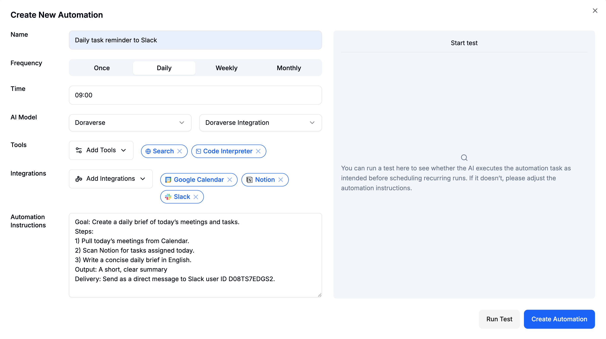

# AI Automation

Automation used to feel too technical — built for coders or big companies with IT teams.

With Doraverse Automation, that changes.

## What is Doraverse Automation?

Doraverse Automation is a no-code way to put your repetitive tasks and workflows on autopilot in minutes.\
With it, anyone can create a workflow that connects their tools and lets AI handle the work exactly like they do — day and night, with no coding and no setup headaches.

* Connects with the apps you already use (Gmail, Google Sheets, Calendar, Slack, Notion, Github, and 50+ more.)
* Gives you the smartest AI brains in one place. Choose GPT-5, Claude 4, Gemini, Grok 4 and so on to work for you, without switching tabs.
* Brings built-in tools like Code Interpreter, Web Search, and Artifact to not just execute, but actually think and create inside your workflow.

With Doraverse Automation, you get an AI coworker that thinks, acts, and integrates directly into your daily work.

***

## Create your Automation in Doraverse

From the conversation sidebar, click **Automation** to open the **Automation Hub.**

Here you can create new automations, manage all the automations you’ve already set up, and explore ready‑made automation templates. You can run up to **10 automations at a time.**

<figure><figcaption></figcaption></figure>

### Choose how you want to create an automation

In Automation Hub, you can start in two ways:

*   **Create from scratch** – design a brand new automation with your own schedule, instructions, tools, and integrations.

    _Click + **Add New** (or **Create your first Automation** if this is your first one)._
*   **Use a template** – pick a ready-made automation template, review its setup, fill in your own project details, then run and save it.

    _Click **Explore Templates** or **Go to templates** to open the templates gallery._

The rest of this guide walks you through both options.

<figure><figcaption></figcaption></figure>

### Option 1 – Create an automation from scratch

When you create from scratch, you start with a blank automation and define everything yourself.

#### Fill in the automation details

<figure><figcaption></figcaption></figure>

**Name:** Use something clear, e.g., _“Weekly Meeting Summary to Slack”_.

**Schedule**: Set Frequency (Once / Daily / Weekly / Monthly) and Time (HH:MM, 24h).\
💡 Tip: Pick the time when your data is ready, like after standups or at the end of the day.

**Choose your AI model:** Select a Provider and Model that fits your workflow.

**Add tools (optional but powerful)** to enhance your automation with Doraverse built-in tools:

* **Search**: when the workflow needs to look up info on the web
* **Code Interpreter**: for spreadsheets, CSVs, calculations, charts, or light data cleaning
* **Artifact**: to generate interactive outputs (e.g., diagrams, HTML pages, web/app demo)

**Add Integrations**\
Include the apps your workflow needs (Gmail, Google Sheets, Calendar, Slack, Notion, Github, etc.). Connect them if you haven’t already.

**Automation Instructions:** Describe the task in plain language. The clearer you are, the better the results.\
\
**Here a template you can follow:**

* **Goal**: What should this automation deliver?
* **Sources**: Which apps/files to read?
* **Steps**: List the actions in order.
* **Output**: Format and tone
* **Delivery**: Where to send it?\
  \
  **Here is an example:**

<figure><figcaption></figcaption></figure>

#### **Run Test**

Click **Run Test** in the preview panel. The AI will execute the task once so you can review the result. Adjust instructions, tools, or model if needed.

<figure><figcaption></figcaption></figure>

#### **Create Automation**

When everything looks good, click **Create Automation**. Your workflow is now live.&#x20;

You can monitor status, check logs, view outputs, pause or edit your automation anytime.

***

### Option 2 – Use an automation template

Templates let you launch a working automation in minutes by starting from a prebuilt workflow instead of a blank one.

#### What are automation templates?

Automation templates are ready-to-use workflows designed for common use cases, with:

* A pre-written **title** and **short description** so you know what it does.
* A suggested **schedule**.
* A preset **AI model**.
* Connected **integrations** (for example, Slack or Notion).
* Pre-configured **Automation Instructions** that already follow best practices.

You simply pick a template, customize a few details, run a quick test, and turn it on.

#### Open the template gallery

From **Automation Hub**, open templates in either way:

* Click **Explore Templates** in the header area, or
* Click **Go to templates** in the banner “_Browse hundreds of ready-to-use automation workflows_”.

Both actions take you to the Templates gallery.

<figure><figcaption></figcaption></figure>

Here you can:

* Search by keyword in **Search templates…**
* Filter by category (e.g., **Personal Productivity, Task Management, Briefings & Digests, Marketing, SEO, Knowledge Management**)
* Scroll through template cards and preview their short descriptions

<figure><figcaption></figcaption></figure>

#### Preview a template

Click any template card to open its details.

You’ll see a side panel with:

* **Title & description** – what this automation does and when it runs.
* **Categories** – where this template fits (e.g., Personal Productivity).
* **Schedule** – the default run time (for example, _Daily at 08:30_).
* **AI Model** – the model or agent this template uses.
* **Integrations** – apps that will be connected (for example, Slack).
* **Automation Instructions** – the exact instructions the AI will follow, often including placeholders like dates, time, or message structure.

If the template fits your use case, click **Add Automation**.

<figure><figcaption></figcaption></figure>

#### Customize the template

After you click **Add Automation**, Doraverse opens the standard **Create New Automation** screen — but now it’s already filled with the template’s settings.

<figure><figcaption></figcaption></figure>

Here you can:

* **Name** – Update the automation name so it matches your team or project (e.g., “Daily Standup – Marketing Team”).
* **Frequency & Time** – Keep the default schedule or change it to when your team actually needs it.
* **AI Model** – Switch to another model if you prefer.
* **Tools** – Add or remove tools like Search, Code Interpreter, or Artifact.
* **Integrations** – Confirm or update the connected apps (e.g., pick the right Slack workspace, channel, or Notion database).
* **Files** (if needed) – Attach any files the automation should read from.
* **Automation Instructions** – Review the pre-filled instructions and:
  * Adjust wording to match your tone or process.
  * Fill in any placeholders (for example, time, links, team names, channels).

This step turns a generic template into _your_ automation.

#### Run Test

Before you save and schedule the template-based automation, you can test it the same way as a manual one.

* Click **Run Test** in the preview panel.
* Doraverse runs the automation once with your current settings.
* Review the output:
  * If it’s not quite right, edit the instructions, schedule, or integrations and run another test.

Templates are designed to be close to “ready to ship”, but testing with your own data ensures they work exactly as you expect.

#### Create Automation

When the test result looks good, click **Create Automation**.

Your template-based automation is now live and appears in your **Automation Hub** list alongside all other automations. From there you can:

* Monitor execution and status
* View logs and outputs
* Pause, resume, or edit the automation at any time

### Getting Started

Starting is easy:

* If you already know exactly what you want: **create from scratch** and design your ideal workflow.
* If you want to move fast: **pick a template**, plug in your tools and schedule, and let your AI coworker handle the repetitive work.

Start small and grow from there: connect more apps, add more workflows, and let your AI coworker take care of the boring stuff while you focus on the work that matters.
