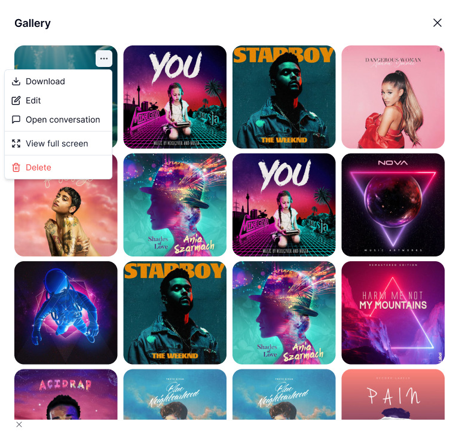

# AI Studio

[What is Doraverse Studio?](ai-studio.md#what-is-doraverse-studio)

[Image Generation with Studio](ai-studio.md#image-generation-with-studio)

[Video Generation with Studio](ai-studio.md#video-generation-with-studio-coming-soon)

[Audio Generation with Studio (Coming soon)](ai-studio.md#audio-generation-with-studio-coming-soon)

[Manage Your Gallery](ai-studio.md#manage-image-in-your-gallery)

## What is Doraverse Studio?

Doraverse Studio is your all-in-one creative playground, designed for teams to bring raw ideas to life — whether you’re crafting compelling images, dynamic videos, impactful slides, or intuitive mindmaps. 

With a suite of powerful Generative AI tools, Studio transforms your concepts into impressive visual and multimedia assets, making creativity accessible and efficient at every stage — no more messy tabs or scattered tools.

### Why Go with Doraverse Studio?

<table data-view="cards"><thead><tr><th></th><th></th></tr></thead><tbody><tr><td><strong>Collab with World’s Leading Generative Models</strong></td><td>Put top-tier AI to work for you: GPT-Image-1, Gemini-Imagen-4, Flux Kontext Pro/Pro Max. </td></tr><tr><td><strong>10x Your Creative Workflow</strong></td><td>Deliver standout creations at lightning speed with powerful automations: auto-prompt, auto-style, auto-size.</td></tr><tr><td><strong>Less Manual Work, More Brilliant Results</strong></td><td>Generate in a chat interface that remembers your context, syncing every creation to your ideas.</td></tr></tbody></table>

***

## Image Generation with Studio

### Step 1: Access Studio&#x20;

From your Doraverse home screen, simply select Studio icon from the main menu. This will take you directly to your Studio space.

<figure><figcaption></figcaption></figure>

### Step 2: Choose AI Models

Choose from leading AI models, preview their generation pricing:

* **GPT-Image-1:** Delivers vivid, accurate visuals with strong detail and natural composition, optimized for creating diverse scenes.
* **Gemini-Imagen-4:** Excels in photorealism, advanced understanding of prompts, and produces rich, expressive images with fine nuances.
* **Flux Kontext Pro/Pro Max:** Offers ultra-fast, high-resolution image generation with customizable styles and precise context handling.

**💡 Tips:** Try generating the same prompt across different models to compare results.

### Step 3: Start Creating

Type your image request directly into the chat box. Just describe what you want, and let Studio handle the rest.&#x20;

Level up your results with built-in automation tools for faster, easier, and more on-point creations:

* **Auto-prompt:** Let AI refine your request for the best possible prompt.
* **Auto-style:** Instantly apply your preferred artistic style, like cartoon, watercolor, anime, 3D, .etc.
* **Custom Size:** Pick the perfect image size to match your platform or purpose.
* **Creation Quantity:** Generate up to 4 images at a time and choose your favorite.

<figure><figcaption></figcaption></figure>

#### Provide more context or fine-tune your outcome?

Hit the "+" icon next to the chat bar and pick your option:

* Upload from your computer
* Browse in Library

### Download Image

<figure><figcaption></figcaption></figure>

Once you’re happy with your creation, simply hover over the image and select Download Image to save it instantly.

### Edit Image &#x20;

If you want to make further adjustments, click Edit Image to continue refining your artwork, no need to start over.&#x20;

The image you want to edit will be automatically added to the upload section, ready for further customization.

<figure><figcaption></figcaption></figure>

### View Image Information

Click on the image to easily view its detailed information. You’ll see attachments and key data such as creation time, author, dimensions, size, and file type.

<figure><figcaption></figcaption></figure>

**💡 Tips**: Pay special attention to the last line. This is the AI prompt used to generate the image. It’s a helpful reference if you want to recreate, tweak, or reuse the prompt in the future.

***

## Video Generation with Studio

Create high-quality videos, fast, right inside Doraverse Studio. We add the most advanced video models and keep them current, so what you use today is the best you can get.

### What you can make

* **Text → Video**: describe the scene and let the model do the magic.
* **Image / Multi-image → Video**: animate a single look or stitch a light storyboard.

📌 Note: Some models handle both text and image inputs (e.g. Veo 3, Seedance). Others are image-to-video only (e.g. Kling Pro). Peek at the model card first — capabilities and limits are clearly listed.

### To generate a video **(same flow as Image Generation)**

* Pick a model: Check the description card for each model’s strengths, supported formats, and cost.
* Upload images (optional): Skip this if you’re going pure text-to-video.
* Type your prompt.
* Set the specs: Choose aspect ratio, size, duration, and audio (if the model exposes it).

<figure><figcaption></figcaption></figure>

You can also make a video from your Studio image by opening your image → choose **Make Video** and repeat the same flow.

<figure><figcaption></figcaption></figure>

***

## Audio Generation with Studio (Coming soon)

***

## Manage Your Gallery

In the Conversation Sidebar, select Gallery— where all generated images are stored and neatly organized for quick access.&#x20;

<figure><figcaption></figcaption></figure>

Inside the Gallery, you can easily:

* Download your favorite images
* Edit image
* Open conversation to review the creative steps behind each artwork
* View full screen for a detailed look
* Delete images you no longer need
* Image Information
