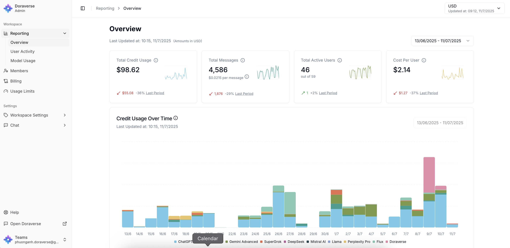

# Copy of AI Debate

## What is Parallel in Doraverse?

Parallel is a fast way to work with multiple AI models in Doraverse — all at the same time.

Instead of debating with each other, the models respond **independently** to the same prompt. You get several different answers in one go, without having to ask each model separately.

While **Debate** lets models read, challenge, and refine each other’s answers to reach a stronger conclusion, **Parallel** focuses on giving you **separate, independent responses** from each model. If you want a multi-step discussion between models instead, learn more in [AI Debate.](https://help.doraverse.com/feature-list/ai-debate)

Parallel is designed for users who want **quick comparison, diverse options, and independent viewpoints** from multiple models in their day-to-day work.

***

## How Parallel works

In Doraverse, all selected models receive the same prompt and generate their own answers independently.

* Each model thinks and responds on its own.
* Models **do not read or react to** each other’s answers.
* There is **no cross‑checking or debating** between models.

You can then scan all responses side by side to compare styles, ideas, and depth of reasoning. It feels like asking the same question to different experts at once — each with their own voice and approach.

This setup is ideal when you want **variety and speed**, rather than a single, refined conclusion.

***

## How Parallel helps your everyday work

Parallel makes it easier and faster to explore options in many scenarios:

* Generate multiple ideas, drafts, or outlines from a single prompt
* Compare how different models interpret your request
* Quickly spot which model fits your task or writing style best
* Save time switching between GPT, Gemini, and other models manually
* Stress‑test a prompt by seeing different responses side by side
* Build alternatives for content, copy, or solutions in one click

With Parallel, you don’t need to manage multiple chats or copy‑paste the same prompt over and over — Doraverse does that work for you.

***

## How to use Parallel in Doraverse

1.  **Choose Parallel in the chat bar.** \
    Select the AI models you want to run in Parallel. All selected models will receive the same prompt and respond at the same time. 

    <figure><figcaption></figcaption></figure>
2.  **Write the topic or problem that needs multi-perspective analysis**\
    This can be a complex question, a decision you need to evaluate, a comparison, or any problem that requires different angles. Or you can start with a suggestions from Doraverse.

    <figure><figcaption></figcaption></figure>
3.  **Run the Parallel responses**\
    After you send the prompt, each model will think and respond independently. You will see a separate card or section for each model’s answer, so you can quickly scan and compare them.

    <figure><figcaption></figcaption></figure>
4. **Review and choose what works best**\
   Read through the responses and pick the one that best fits your needs — or combine ideas from multiple models. You can continue the conversation with a specific model, refine a chosen answer, or start a new Parallel run with adjusted prompts or models.

<figure><figcaption></figcaption></figure>

<figure><figcaption></figcaption></figure>

***

## When to use Parallel vs. Debate?

You can think of Debate and Parallel as two different ways of working with multiple models:

<table><thead><tr><th width="103">Mode</th><th>How it behaves</th><th>Best for</th></tr></thead><tbody><tr><td>Debate</td><td>Models read and challenge each other, Doraverse summarizes.</td><td><strong>Checking model answers</strong>, risk analysis, multi‑perspective evaluation.</td></tr><tr><td>Parallel</td><td>Models answer independently, no interaction between them.</td><td><strong>Fast comparison</strong>, idea generation, testing prompts and models.</td></tr></tbody></table>

Use **Parallel** when you want **many independent answers quickly**.

Use **Debate** when you want **a refined conclusion from a multi‑step discussion**.

***

Try Parallel on your next task — one prompt, multiple answers, and a faster path to the version that works best for you.
