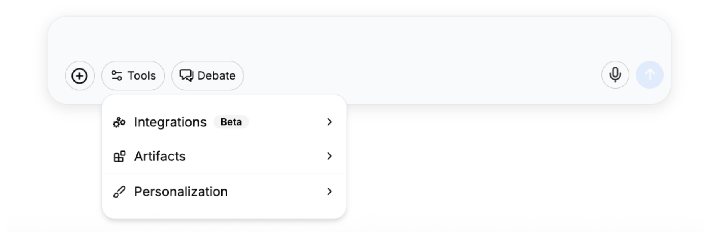
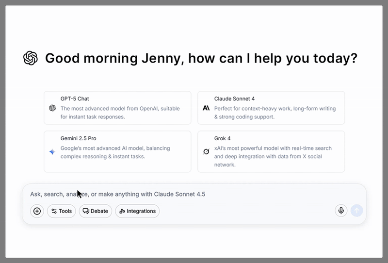
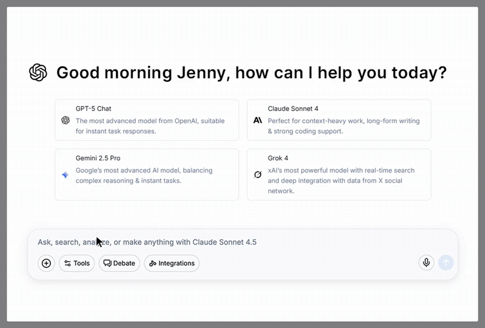
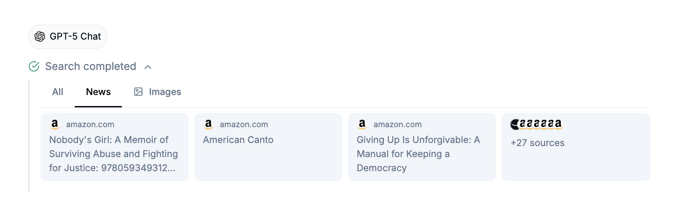

# Tools

[Personalization](tools.md#personalization)

[Artifact](tools.md#ai-artifact)

[Web Search & Code Interpreter](tools.md#web-search-and-code-interpreter)

Located conveniently in the chat bar, Doraverse offers powerful built-in tools that extend AI model capabilities beyond just text-based conversations.&#x20;

<figure><figcaption></figcaption></figure>

## Personalization&#x20;

<figure><figcaption></figcaption></figure>

The Personalization in Doraverse lets you customize how all AI models interact with you. From setting a nickname and title to defining the traits and communication style that resonate with your personality, you have the power to create an AI experience tailored exclusively to you.&#x20;

With your preferences securely in place, you won’t need to repeat information — Doraverse remembers the context and continuously provides answers that align with your unique needs.

Modify these settings anytime to keep your interactions fresh, personalized, and effortlessly connected to you.

## Artifact

**Artifact** is a built‑in tool that turns your prompts and files into interactive work — from everyday dashboards and reports to full websites and app UIs.&#x20;

Preview changes live in Canvas, then export self‑contained HTML/CSS/JS to paste into your stack or download as a file. No setup. Just describe the outcome and watch it build.

<figure><figcaption></figcaption></figure>

### What you can do with Artifact:

* Dashboards and reports with filters, tooltips, and dark mode
* CSV to live report, with KPI tiles, trends, cohorts, outliers and more
* Email HTML with branded styling
* Campaign microsites and landing pages — responsive and fast
* React components and app screens (forms, tabs, modals, validation,...)
* Diagrams and data stories—org charts, architecture maps, funnels
* Knowledge and help — product tours, interactive guides, JSON/log viewers

...and endless use cases are waiting for you. If you can imagine it, AI Artifact can bring it to life.

## Web Search & Code Interpreter

Doraverse now uses **Automatic tool orchestratio**n to make **Web Search and a built‑in Code Interpreter available to every AI model by default**.&#x20;

That means any model can search the web for the latest info (news, images) with inline citations, and write/run Python for file handling, coding, and charts. No manual tool toggles, no worrying about a model’s native browsing or coding support.

<figure><figcaption></figcaption></figure>

<figure><figcaption></figcaption></figure>

