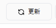

# 📋 Reporting

Reporting tab is your central hub for monitoring and managing AI activities across your organization. It brings together all essential reports and analytics for quick, data-driven decision-making.

## **What’s included in the Reporting:**

### [**Overview**](https://help.doraverse.com/jp/admin/dashboard/overview)

Get a real-time summary of your organization’s AI usage and spending for any selected period.

<figure><figcaption></figcaption></figure>

### [**User Activity Report**](https://help.doraverse.com/jp/admin/dashboard/user-activity-report)

Gain detailed insights into user engagement and usage trends across your organization.

<figure><figcaption></figcaption></figure>

### [**Model Usage Report**](https://help.doraverse.com/jp/admin/dashboard/model-usage-report)

Analyze the usage and costs of each AI model to optimize performance and spending.

<figure><figcaption></figcaption></figure>
