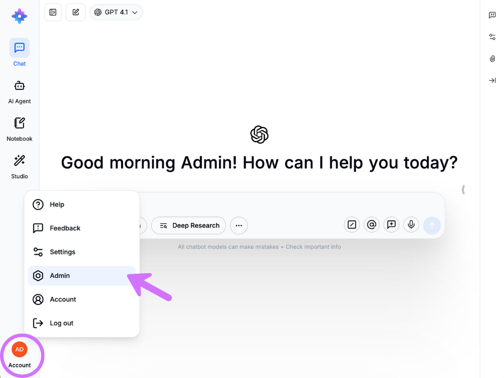
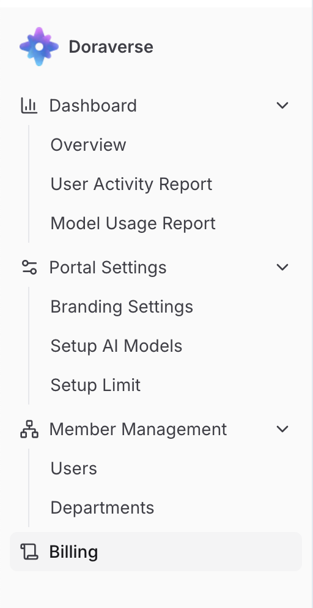

# 🚪 Welcome to Admin Workspace

## What is Admin Workspace?

Admin Workspace in Doraverse is a centralized control panel for administrators to manage users, departments, AI models, and usage across the organization. It empowers admins to monitor activity, manage access, and ensure efficient, secure operations.

## What's in Admin Workspace?


[dashboard](dashboard/)



[member-management.md](../member-management.md)



[Broken link](broken-reference)



[setup-ai-models.md](../setting/setup-ai-models.md)



[setup-ai-limits.md](../setting/setup-ai-limits.md)



[branding-setting](../setting/branding-setting/)


## How to Access Admin Workspace?

1. Click on **Account** in the bottom-left corner of the screen.
2. Select **Admin**.&#x20;

You’ll now see the **Admin Workspace** with multiple control tabs designed for administration.

<figure><figcaption></figcaption></figure>

<figure><figcaption></figcaption></figure>

💡 **Note:** The **Admin Workspace** is only visible to users with admin role. For access, please contact your organization’s Doraverse administrator.

