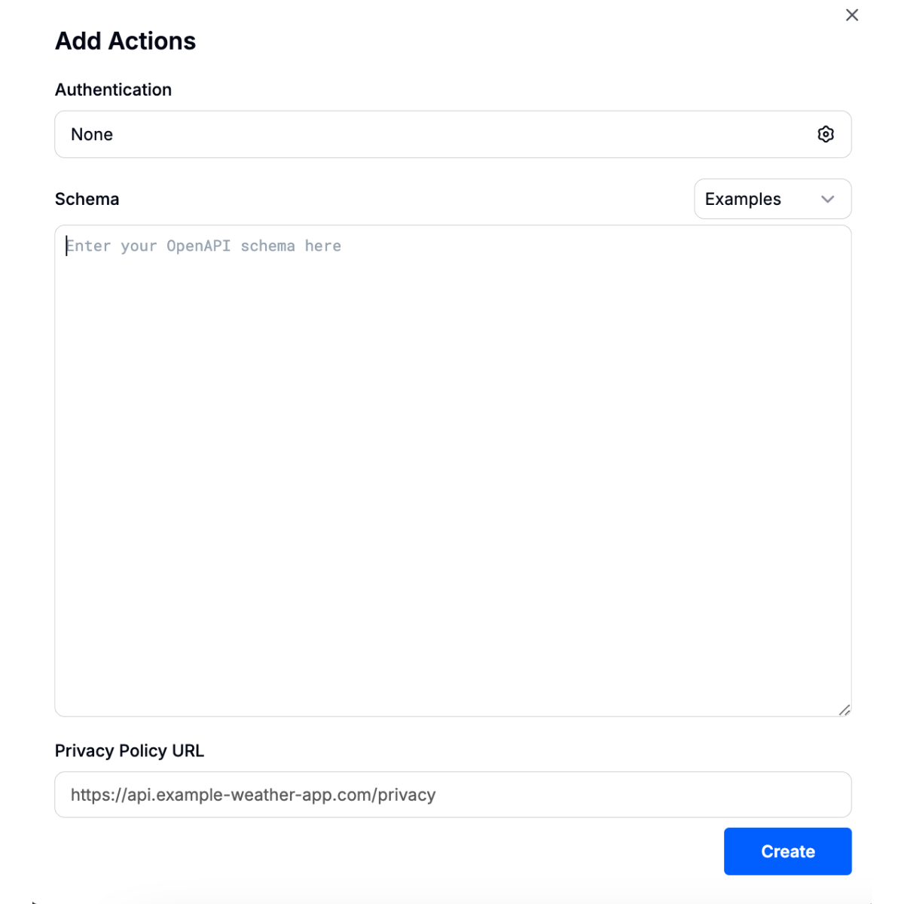
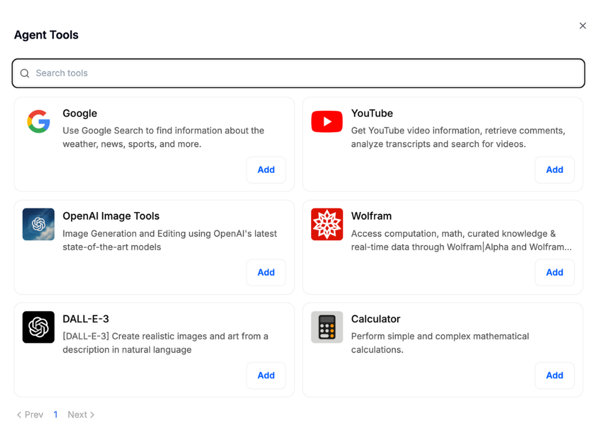
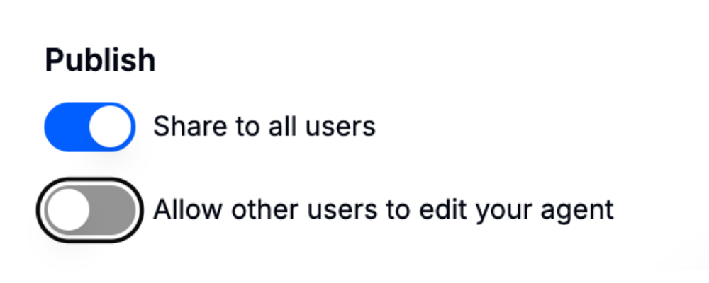

# AI Agents

[DoraverseのAI Agent機能](./#ai-agent-feature-in-doraverse)

[DoraverseでAI Agentを作成する手順ガイド](./#step-by-step-guide-to-build-your-own-ai-agent-in-doraverse)

[Agentの利用方法](./#using-your-ai-agent)

[DoraverseでAI Agentを作成する理由](./#why-build-ai-agents-in-doraverse)

## DoraverseのAI Agent機能

DoraverseのAI Agent機能では、コーディング不要で業務やワークフローに合わせた知的アシスタントを設計できます。世界最高水準のAIモデルと強力な内蔵ツールにより、専門的な機能を持つAgentを簡単に作成し、業務支援やタスク自動化、パーソナライズされた応答を実現できます。

## DoraverseでAI Agentを作成する手順

***

### 1. Agent Builderにアクセス

ホーム画面のナビゲーションサイドバーから **AI Agent**を選択してください。

AI Agentスペースに移動します。ここでは、自分やチームのカスタムAI Agentを探索・作成できます。

画面は以下の3つのセクションで構成されています。

* **最近使用履歴:** 直近で利用したAI Agentをすぐに見つけられます。
* **あなたのAI Agent:** 自分が作成したすべてのAgentを表示・管理できます。
* **あなたのチームによって:** チームメンバーが作成したAgentを発見し、共同利用できます。

### 2. Agent を作成する

画面右上の**AI Agent を作成する**ボタンをクリックします。**Agent ビルダー**が開き、カスタム AI Agent をゼロから設計できます。

Agent の作成には以下が含まれます。

* **基本設定**：アバター、名前、説明、インストラクション、プロバイダー＆モデル、モデルパラメータ
* **詳細設定**：会話のきっかけ、ナレッジ、Code Interpreter API、ケイパビリティ、ツール＋アクション

### 2.1 基本設定：AI Agent のコアプロフィールをカスタマイズ

Agent 作成時の基本設定は、Agent のアイデンティティと動作を決定する重要な要素です。

<figure><figcaption></figcaption></figure>

効果的な設定のために知っておくべきポイント：

### アバター

画像をアップロードして、Agent のプロフィールを個性的にし、チームで認識しやすくします

### 名前

Agent の目的が分かりやすい、明確で関連性のある名前を選んでください。

### 説明

Agent の役割を簡潔に説明するメモを追加し、チームが機能と価値をすぐに把握できるようにします。

例：会議の議事録を自動で要約します。

***

### 使用方法

システムインストラクションは、Agent の基本的な動作を定義します。明確かつ具体的な指示を書くことで、Agent が一貫して期待通りに動作します。以下の内容を含めてください：

* Agent の振る舞い方
* 注力すべき内容
* 常に守るべきルールや制約

***

### プロバイダ & モデル

利用可能な AI モデルから、タスクに最適なものを選択します。各モデルには特長があり、用途に応じて使い分けが可能です。

[**Doraverse の利用可能な AI モデル**](https://doraverse.gitbook.io/docs/feature-list/available-ai-models) を参照し、各モデルの特性や推奨用途を確認してください。

***

### モデルパラメータ

これらの設定は、AI Agent が入力を処理し、応答を生成する方法を制御します。モデルパラメータによって Agent の思考やコミュニケーションの仕方を調整でき、精度や創造性を最適化できます。

* **Temperature（ランダム性・創造性）**：応答の創造性や多様性を制御します。値を高くすると想像力豊かな回答になり、低くすると焦点が定まり予測しやすい応答になります。
* **Top\_p（応答の多様性）**：応答時に考慮する単語の選択肢を制御します。値が低いほど最も確率の高い単語に絞り、精度重視の応答になります。値が高いと多様性が増します。

**注意:** Temperature と Top\_p は同時に調整しないことを推奨します。

* **Max Context Tokens（入力長の上限）**：入力や会話履歴からモデルが利用できる最大トークン数（単語や単語の一部）を設定します。
* **Max Output Tokens（出力長の上限）**：モデルの応答の最大長（トークン数）を制限します。
* **Frequency Penalty（繰り返し抑制）**：同じ単語やフレーズの繰り返しを抑え、応答の新鮮さを保ちます。
* **Presence Penalty（話題の広がり）**：既存の話題の繰り返しを避け、新しい話題やアイデアの導入を促します。
* **Prompt Caching（入力の再利用）**：前回のプロンプトの一部を記憶し、再試行や再生成時に応答速度を向上させます。
* **Stop Sequences（応答終了マーカー）**：モデルが応答を終了するための特定の単語やフレーズを定義します。
* **Reasoning Effort（思考の深さ）**：応答の検討深度を調整します。値を高くすると、より丁寧で詳細な回答が得られます。
* **Image Detail（画像解析の精度）**：アップロードした画像の解析レベルを制御し、視覚的な分析の質や詳細度に影響します。
* **Resend Files（ファイル再処理）**：アップロード済みファイルを再生成時に再処理するかどうかを設定します。結果の更新や再試行時に便利です。

_**🤔**_**&#x20;パラメータの最適化方法が必要ですか？**

より詳しい手順や実践例については、[**モデルパラメータガイド**](https://doraverse.gitbook.io/documents/feature-list/ai-agents/ai-model-parameter-guide)をご覧ください。Agent のパフォーマンスを最大限に引き出すための、わかりやすいステップと具体的なヒントを掲載しています。

**ご注意:** 追加の設定項目にアクセスするには、必ず**AI Agent を作成する**をクリックしてください。

### 2.2 さらに高度な設定：AI Agent の機能を強化する

追加の設定を活用することで、AI Agent に高度な機能や柔軟性を持たせ、より賢くタスクを理解・実行できるようになります。

<figure><figcaption></figcaption></figure>

### 会話のきっかけ

Agentが会話を始める際に使う初期プロンプトを設定できます。これにより、最初のやり取りから目的が明確になり、ユーザーもスムーズに利用を開始できます。

<figure><figcaption></figcaption></figure>

***

### 知識

**ファイル検索**

Agentの知識ベースは、正確かつ関連性の高い回答を提供するための情報源です。**ファイルを追加**することで、Agentはアップロードしたドキュメントを検索・参照でき、質問の意図も理解できます。リサーチやオンボーディング、データ活用に最適です。

**Code Interpreter API**

Code Interpreter API は、自然言語での指示に基づきコンピューターコードを理解・実行できるスマートアシスタントです。Code Interpreter 用にアップロードすれば、コードの処理・分析・作成を迅速かつ正確にサポートします。特別なセットアップは不要です。

***

### 機能

**Code Interpreter を有効にする** Agent が以下の機能を使用できるように、本機能を有効にします。

* Python、JavaScript、Go、C++、Java、PHP、Rust など、さまざまな言語でコードを、ローカル環境や設定、サンドボックスなしで実行できます。
* ファイルのアップロードとダウンロードをスムーズに管理し、シームレスなワークフローを実現します。
* ファイルを安全に処理・分析します。複雑な計算や大規模データの取り扱いも可能です。

**アーティファクトを有効化**するタイミング：

* ReactコンポーネントやHTMLスニペット、ダイアグラムなどのビジュアルまたはインタラクティブな出力を自動生成したい場合
* 結果を専用のUIウィンドウで視覚的に分かりやすく表示したい場合
* Agentが生成・表示するインタラクティブ／ビジュアルコンテンツをカスタマイズしたい場合

**ファイル検索を有効化する**タイミング：

* アップロードしたドキュメントから直接事実を取得し、リサーチやオンボーディング、ナレッジアクセスに即時対応したい場合
* キーワードだけでなく意味や意図を理解するセマンティック検索機能が必要な場合

***

### ツール＋アクション

**アクション**

アクションを使うと、API経由で外部サービスと連携し、AI Agentの機能を拡張できます。これにより、天気の確認、会議の予約、重要な情報の取得など、現実世界のデータとやり取りしながらさまざまなタスクを自動で実行できるようになります。\
Agent に新しいスキル――**他のプログラムとシームレスにやり取りする力**――を教えるイメージです。

<figure><figcaption></figcaption></figure>

アクションを作成する際は、以下の情報が必要です。

* **認証**：サービス接続時にパスワードや特別なアクセス権が必要か指定します。不明な場合は「なし」のままで問題ありません。
* **スキーマ**：AI Agent がサービスと通信する方法を定義します。多くの場合、用意されたサンプルから選択できますが、技術的な内容はチームのエンジニアに相談してください。
* **プライバシーポリシーURL**：サービスのプライバシーポリシーへのリンクを追加し、透明性と信頼性を確保します。

設定が完了すると、Agent は新しいアクションを実行できるようになり、さらに役立つ存在になります。

**インテグレーション**

Google検索、画像生成、計算などの強力な外部サービスとAgent を連携できます。ワークフローに必要なインテグレーションだけを選択し、Agent の集中力とインターフェースの見やすさを保ちましょう。

<figure><figcaption></figcaption></figure>

***

### Agent の公開

これらの設定で、Agent の利用・編集権限をコントロールできます。

* **全ユーザーに共有**：組織内の全員が Agent を検索・利用できます。
* **他のユーザーによる編集を許可**：チームメンバーが Agent の設定を共同編集できます。オフの場合、編集できるのは自分だけです。

<figure><figcaption></figcaption></figure>

## Agent の使い方

チャットバーで「@」を入力し、Agent  名を指定するとチャットで呼び出せます。

<figure><figcaption></figcaption></figure>

### 💡ヒント

* Agent  はいつでも編集・更新・複製できます。ニーズに合わせて柔軟に運用しましょう。
* テストも重要です。実際に使い、フィードバックを反映してスキルを磨いてください。

***

## DoraverseでAI Agent を作る理由?

* **専門知識不要**：すべて日常的な言葉で説明され、直感的に設定できます。
* **カスタム対応**：レポート作成、FAQ対応、ファイルからのインサイト抽出など、用途に合わせて最適な Agent  を作成できます。
* **成果重視**：時間短縮・作業の自動化・生産性向上を実現。Agent  は24時間365日、組織のニーズに合わせて稼働します。

