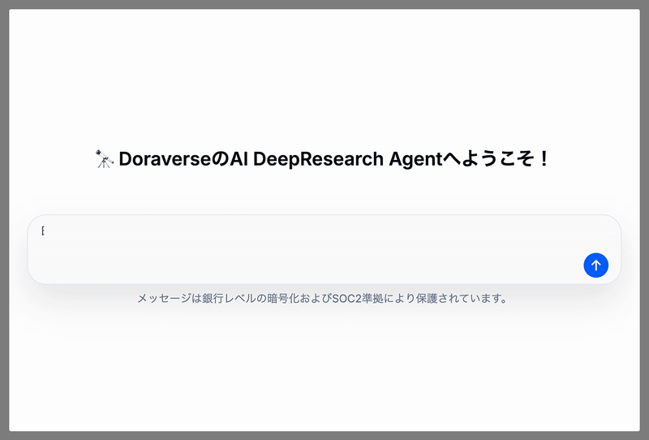
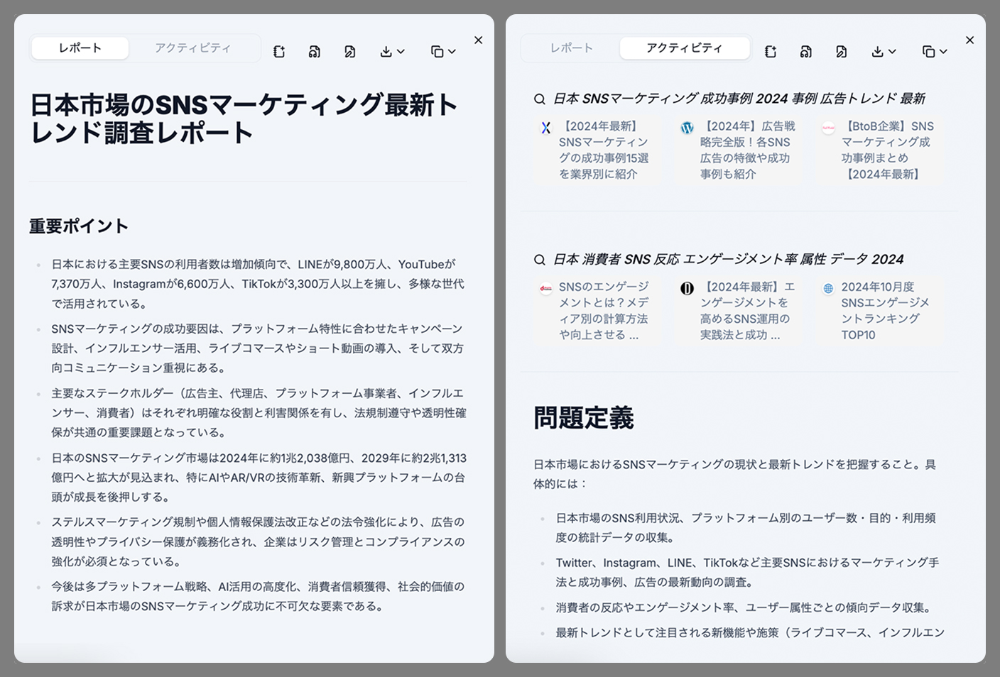

# Deep Research

[Deep Researchとは](deep-research.md#what-is-doraverses-deep-research)

[Deep Researchの使い方](deep-research.md#how-to-use-deep-research)

## Deep Researchとは?

Deep Researchは、DoraverseのAI搭載リサーチアシスタントです。専任のリサーチチームのように、調査計画の立案からウェブ全体の検索、数百件のオンライン情報源の統合までを自動で行い、網羅的かつ分析レベルのレポートを作成します。

DoraverseのDeep Researchは、モジュール型のマルチAgentワークフローを採用し、各ステージで**お客様が主導権を持てます**。人間による計画（human-in-the-loop planning）、強力な検索・クロール、データ自動処理を組み合わせ、あらゆるテーマを明確で実用的なインサイトに変換します。

**Deep Researchでできること：**

* **調査を大幅に効率化**：手作業による検索の手間を省き、数分でレポートを取得できます。
* **より深いインサイトを獲得**：ウェブ、学術、構造化データを組み合わせ、全体像を把握できます。
* **すべての事実を検証可能**：各インサイトには、すぐに確認できる実際の出典がリンクされています。
* **形式を選択可能**：仕上がったレポート、ポッドキャスト形式の要約、Markdown/PDFファイルとして受け取れます。

***

## Deep Researchの使い方

### ステップ **1:** トピックを定義

* 調査したいトピックや質問を入力します。
* 地域・業界・期間などのコンテキストを追加すると、AIがより的確に調査します（任意）。

送信後、Deep Researchがご要望に合わせた明確なアクションプランを即時生成します。

<figure><figcaption></figcaption></figure>

### ステップ2：調査計画の確認・編集

AIによる調査計画を事前に確認し、必要に応じて調整できます。目標や重点領域の明確化、必須項目の追加も自然な日本語で編集可能です。

内容に納得したら**Start Research**をクリックしてください。

### ステップ3：調査の進行を確認

AIが調査全体（検索、記事の精査、データ収集、レポート作成）を自動で進めます。その間、お客様は他の作業に集中できます。

<figure><figcaption></figcaption></figure>

**アクティビティ**タブで、訪問サイト・読んだ内容・発見事項・参照元など、リアルタイムで進捗を確認できます。各ステージの状況が常に把握できます。

完了後は**レポート**タブで、構造化され出典明記の専門レポートを受け取れます。信頼できる実用的なインサイトが満載です。

### ステップ4：レポートを活用

* **NotebookAI**に保存して、いつでもすぐに参照
* **ポッドキャスト形式の音声要約**を生成
* Doraverse上で直接レポートを編集
* **Markdown、PDF、HTML**としてダウンロード

DoraverseのDeep Researchがあれば、必要な知識にワンクリックでアクセスでき、自信を持って次の一歩を踏み出せます。
