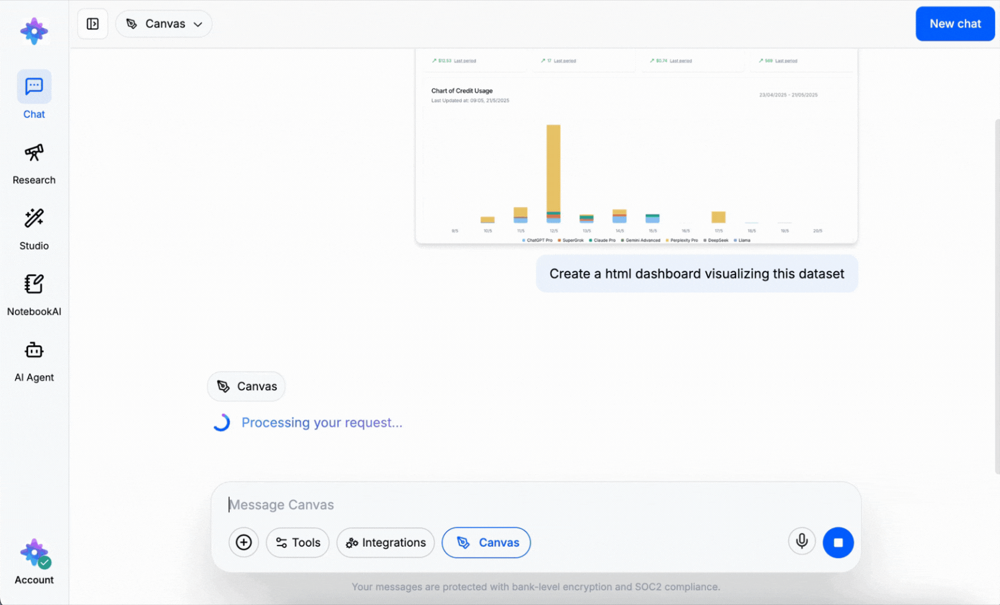

# Tools

[Personalization](tools.md#personalization)

[Search Tool](tools.md#search-tool)

[Code Interpreter](tools.md#code-interpreter)

[Canvas](tools.md#canvas)

Located conveniently in the chat bar, Doraverse offers powerful built-in tools that extend AI model capabilities beyond just text-based conversations.&#x20;

<figure><figcaption></figcaption></figure>

## Personalization&#x20;

<figure><figcaption></figcaption></figure>

The Personalization in Doraverse lets you customize how all AI models interact with you. From setting a nickname and title to defining the traits and communication style that resonate with your personality, you have the power to create an AI experience tailored exclusively to you.&#x20;

With your preferences securely in place, you won’t need to repeat information — Doraverse remembers the context and continuously provides answers that align with your unique needs.

Modify these settings anytime to keep your interactions fresh, personalized, and effortlessly connected to you.

## **Search Tool**

<figure><figcaption></figcaption></figure>

Doraverse’s advanced Search tool delivers the latest web data, ensuring your answers are always up-to-date. With integrated news, images, and inline citations linked to verified sources, you get complete, trustworthy responses —all in a single interface.&#x20;

Enabled automatically, this Search tool provides all AI models with web search capabilities, ensuring they deliver precise and context-rich results to meet your needs.

## **Code Interpreter**

<figure><figcaption></figcaption></figure>

The Code Interpreter tool empowers AI models to write and execute Python code within a secure, sandboxed environment, enabling them to tackle complex challenges across various domains such as data analysis, coding, and mathematics.&#x20;

Key uses include:

* File Processing: Handle diverse data formats effortlessly.
* Data Visualization: Generate files featuring graphs and visualizations.
* Iterative Problem-Solving: Write and execute code step-by-step to address intricate problems efficiently.

## **Canvas**

<figure><figcaption></figcaption></figure>

Canvas tool in Doraverse is designed to streamline visualization workflows by instantly generating **React components, HTML structures, and Diagrams.**

Features include:

* **Separate UI window** within your chat
* **Interactive Editing:** Directly modify and debug code in real-time.
* **Live Preview**: Instantly view outcomes of your edits for quick iterations.

###
