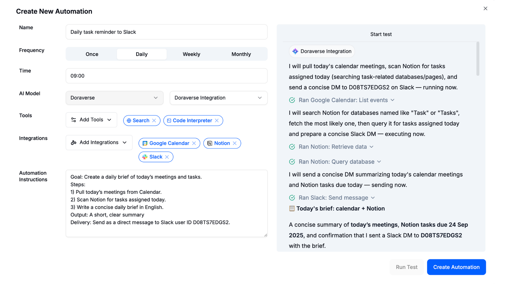

# AI Automation

Automation used to feel too technical — built for coders or big companies with IT teams.

With Doraverse Automation, that changes.

## What is Doraverse Automation?

Doraverse Automation is a no-code way to put your repetitive tasks and workflows on autopilot in minutes.\
With it, anyone can create a workflow that connects their tools and lets AI handle the work exactly like they do — day and night, with no coding and no setup headaches.

* Connects with the apps you already use (Gmail, Google Sheets, Calendar, Slack, Notion, Github, and 50+ more.)
* Gives you the smartest AI brains in one place. Choose GPT-5, Claude 4, Gemini, Grok 4 and so on to work for you, without switching tabs.
* Brings built-in tools like Code Interpreter, Web Search, and Artifact to not just execute, but actually think and create inside your workflow.

With Doraverse Automation, you get an AI coworker that thinks, acts, and integrates directly into your daily work.

***

## Create your Automation in Doraverse

From the top conversation bar, click **Automation** to open the **Automation Hub.**\
Here you can create a new automation or manage all your existing ones. You can run up to **10 automations at a time**.

<figure><figcaption></figcaption></figure>

### Fill in the automation details

<figure><figcaption></figcaption></figure>

**Name:** Use something clear, e.g., _“Weekly Meeting Summary to Slack”_.

**Schedule**: Set Frequency (Once / Daily / Weekly / Monthly) and Time (HH:MM, 24h).\
💡 Tip: Pick the time when your data is ready, like after standups or at the end of the day.

**Choose your AI model:** Select a Provider and Model that fits your workflow.

**Add tools (optional but powerful)** to enhance your automation with Doraverse built-in tools:

* **Search**: when the workflow needs to look up info on the web
* **Code Interpreter**: for spreadsheets, CSVs, calculations, charts, or light data cleaning
* **Artifact**: to generate interactive outputs (e.g., diagrams, HTML pages, web/app demo)

**Add Integrations**\
Include the apps your workflow needs (Gmail, Google Sheets, Calendar, Slack, Notion, Github, etc.). Connect them if you haven’t already.

**Automation Instructions:** Describe the task in plain language. The clearer you are, the better the results.\
\
**Here a template you can follow:**

* **Goal**: What should this automation deliver?
* **Sources**: Which apps/files to read?
* **Steps**: List the actions in order.
* **Output**: Format and tone
* **Delivery**: Where to send it?\
  \
  **Here is an example:**

<figure><figcaption></figcaption></figure>

### **Run Test**

Click **Run Test** in the preview panel. The AI will execute the task once so you can review the result. Adjust instructions, tools, or model if needed.

<figure><figcaption></figcaption></figure>

### **Create Automation**

When everything looks good, click **Create Automation**. Your workflow is now live.&#x20;

You can monitor status, check logs, view outputs, pause or edit your automation anytime.

***

### Getting Started

Starting is easy: Pick one task or workflow that eats your time, create the automation in Doraverse, and focus on what matters while your AI coworker handles the rest.

Start small and grow from there: connect more apps, add more workflows, and let your AI coworker take care of the boring stuff.

