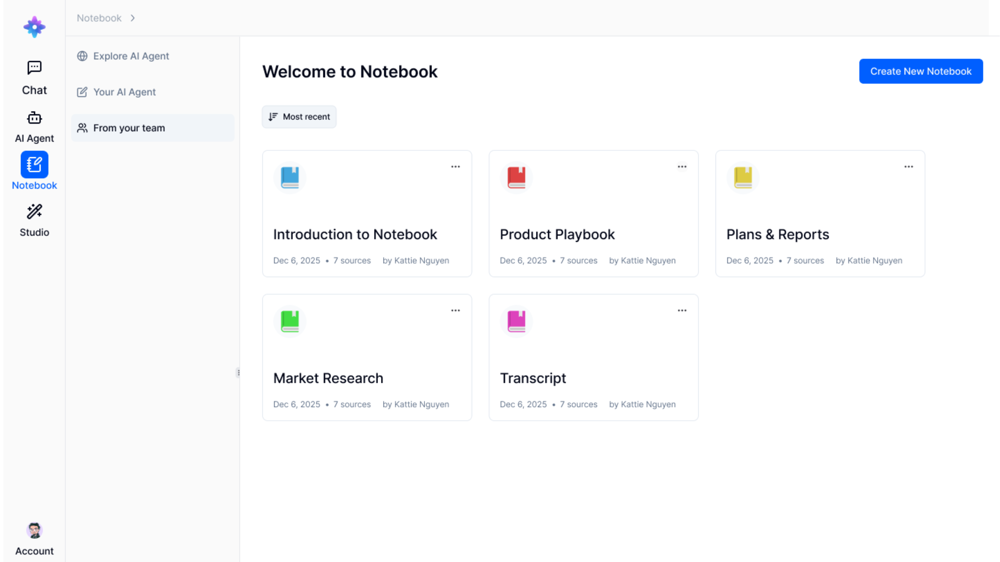

# NotebookAI

## What is Doraverse NotebookAI?

Doraverse NotebookAI is your **Digital Library for work**, designed to help you centralize, organize, and unlock insights from your internal knowledge and documents.&#x20;

With intuitive search and intelligent analysis, NotebookAI transforms static data—like company manuals, project notes, scattered reports—into valuable insights, while ensuring absolute protection of your company’s data.

## Create your NotebookAI

From your Doraverse home screen, simply select Notebook icon from the main menu. This will take you directly to your personal NotebookAI space.

<figure><figcaption></figcaption></figure>

To create a new notebook, click Create New Notebook.

You’ll be prompted to personalize your notebooks:

* Set a Notebook Title
* Choose an Icon Color for quick visual identification

***

## Using Your NotebookAI

<figure><figcaption></figcaption></figure>

### Step 1: Add Your Sources

A “source” refers to any document or piece of content you add to the NotebookAI, such as project reports, documents or transcripts.

Each notebook can contain up to 50 sources. Supported file types include PDF, text (.txt), and Markdown.&#x20;

#### Ways to add sources:

* Upload from your computer
* Add from Google Drive\
  If you haven’t connected your Google Drive yet, see [H**ow to connect your Google Drive to Doraverse**](https://help.doraverse.com/feature-list/chat-with-ai-models#how-to-connect-your-google-drive-to-doraverse)
* Paste content: Copy and paste plain text and Markdown.

### Step 2: Chat with Your Documents

Unlock knowledge with AI-powered Q\&A, following:

* Select one or multiple documents from your sources to interact with.
* Pick your preferred AI model for the conversation.
* Type your question
* Receive fast, reliable answers grounded in your provided information. Each answer includes clickable citations that link directly to the quoted sources, so you can use them with confidence.

<figure><figcaption></figcaption></figure>

**📌 Important note:**

* The AI only uses the materials you have uploaded. Answers do not reference external data.
* Conversations are never stored. Each chat is private and resets with the Refresh button or when you start a new session.

### Step 3: Save to Notes

For any answer you find valuable and want to keep for future reference, simply **save it as a Note.**

Notes help you collect and organize insights, making it easy to revisit findings and share with your team.

#### Managing Notes:

* Access your saved Notes by toggling the button on the top-right of chat.
* Review, organize, or delete Notes as you needed.
* You can convert any Note into a full document (each Note can be converted once).

***

## Example Use Cases

Centralize Project Documentation for Instant Q&#x26;A

Upload and organize files from every team member, ensuring everyone has access to the latest information. Easily share Notebooks and Notes to promote seamless collaboration and keep your team aligned.

Summarize Documents, Notes, and Reports Effortlessly

Quickly generate concise summaries from lengthy documents, scattered notes, or complex reports. NotebookAI highlights key topics and connects related ideas, making information easy to digest and act on.

Brainstorm, Spark Ideas, and Capture Key Insights

Store brainstorming sessions, market analyses, and competitor research in NotebookAI. Leverage AI to identify emerging trends, suggest new initiatives, and surface hidden insights—transforming ideas into actionable strategies.

Create Professional Presentation Outlines

Upload your source materials and let NotebookAI automatically structure them into polished presentation outlines, complete with main talking points and supporting evidence—ready for meetings, pitches, or stakeholder reviews.

Accelerate Onboarding

Empower new team members with instant access to searchable company knowledge. NotebookAI enables quick understanding and analysis of internal policies and resources, speeding up integration and productivity.

