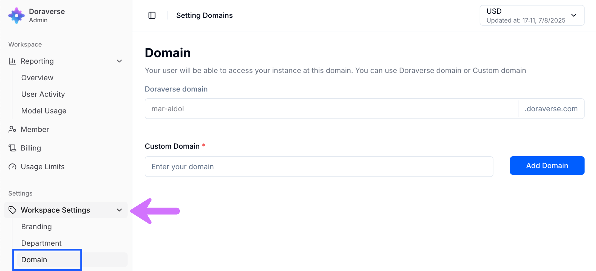
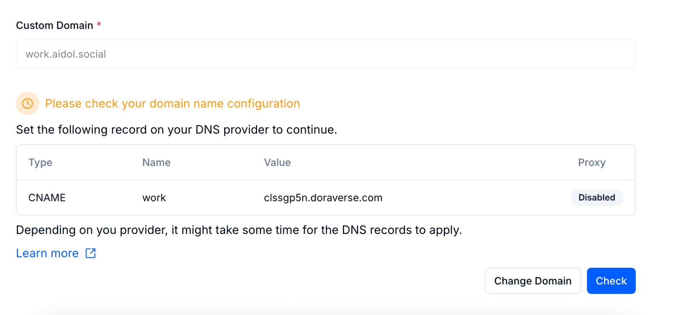

# Custom Domain

In Doraverse, you can set up a custom domain (like `ai.my-domain.com` or `work.my-domain.com`) so your workspace is easier to remember, access, and truly feels like your own.

> 📌 Please note:
>
> Doraverse doesn’t sell domains or replace your current domain provider. You’ll need a domain that you already own and manage elsewhere. Doraverse simply connects your domain to your chosen custom domain.

Below is a step-by-step guide to get you up and running.

### Step 1: Access Your Admin Workspace

From your home screen, go to: Account → Admin Settings → Workspace Settings → Domain.&#x20;

<figure><figcaption></figcaption></figure>

### Step 2: Enter Your Custom Domain

There are a few important rules to follow when adding your custom domain to ensure a smooth setup:

* You must already own your domain (bought from domain registrars like Namecheap, GoDaddy, etc.).
*   Include a subdomain when entering your custom domain, such as:

    `wwww.my-domain.com`\
    `work.my-domain.net`\
    Any subdomain is fine (e.g., `chat.my-domain.com`)

<figure><figcaption></figcaption></figure>

In the example:&#x20;

* `aidol.social` is your root domain (sometimes called your main domain)
* `work` is the subdomain prefix — this is the part you add in front of your main domain.

👉  Together, your full subdomain becomes `work.aidol.social`       &#x20;

> ❓Why a subdomain?
>
> Most providers require a subdomain (the part before the main domain, like “www” or “portal”) for the connection to work properly.

Click **Add Domain**. Doraverse will show you the exact DNS record you’ll need to add to your domain provider.

<figure><figcaption></figcaption></figure>

### Step 3: Set Up a CNAME Record with Your Domain Provider

* Go to your domain registrar’s dashboard (where you manage your domain). Find the settings called DNS Records or Host Records.
* Create a CNAME record with the details provided by Doraverse:
  * Host/Name: Copy the “Name” shown in Doraverse.
  * Value/Points to: Copy the “Value” shown in Doraverse.
  * TTL (Time To Live): You can leave TTL on “Automatic,” which works fine for most users. If you want your changes to update more quickly, set TTL to a low value like 5 minutes.&#x20;

<figure><figcaption></figcaption></figure>

Save your changes. DNS records might take sometime to update.

### Step 4: Check Your Connection

Return to the Domain setting space in Doraverse. Click **Check.**\
If everything is set up correctly, your workspace is now live at your custom address.

<figure><figcaption></figcaption></figure>

You can always change the custom domain later. Just repeat the setup steps carefully to update your settings.

<figure><figcaption></figcaption></figure>

***

### 💡 Tips: Fixing "Domain Name Mismatch Detected"&#x20;

<figure><figcaption></figcaption></figure>

If you enter this error, it means: Doraverse checked your DNS settings and found the CNAME or domain name you entered doesn't match what’s in your DNS provider’s records.

### How to Fix:

* Double-check the domain/subdomain you typed. Make sure it matches exactly (no typos, extra spaces, or missing words). Do not include https:// or http:// (That is a link, not a domain name)
* Ensure you have added the **CNAME record** exactly as shown by Doraverse:\
  Type: CNAME\
  Name/Host: Copy what’s shown (example: work)\
  Value/Points to: Copy the full value (example: clsb31ax1.doraverse.com)
* Don’t use your root domain (like mycompany.com) as the CNAME "Name" unless instructed.
* Wait a few minutes and retry — sometimes DNS updates aren’t instant.

<strong>Learn more about domains</strong>

[https://www.godaddy.com/help/what-is-dns-665\
\
https://www.godaddy.com/help/manage-dns-records-680\
\
https://www.namecheap.com/support/knowledgebase/article.aspx/434/2237/how-do-i-set-up-host-records-for-a-domain/\
\
https://www.namecheap.com/support/knowledgebase/article.aspx/9646/2237/how-to-create-a-cname-record-for-your-domain/\
\
https://developers.cloudflare.com/dns/zone-setups/partial-setup/setup/\
\
https://support.squarespace.com/hc/en-us/articles/360002101888-Adding-custom-DNS-records-to-your-Squarespace-managed-domain](https://www.godaddy.com/help/what-is-dns-665https://www.godaddy.com/help/manage-dns-records-680https://www.namecheap.com/support/knowledgebase/article.aspx/434/2237/how-do-i-set-up-host-records-for-a-domain/https://www.namecheap.com/support/knowledgebase/article.aspx/9646/2237/how-to-create-a-cname-record-for-your-domain/https://developers.cloudflare.com/dns/zone-setups/partial-setup/setup/https://support.squarespace.com/hc/en-us/articles/360002101888-Adding-custom-DNS-records-to-your-Squarespace-managed-domain)

